# Capstone Project Part 3 - Spreadsheet Dashboard

## Assignment title
Business Data Cleaning, Pivot Analysis, and Dashboard Capstone Project

## Student details
- Student name: Abhilash Pandey
- Student ID: rotman_ddm_2602008

## Dataset overview
This project uses three related raw datasets:
- `customers_raw.xlsx`
- `products_raw.xlsx`
- `orders_raw.xlsx`

The objective is to clean the datasets, document data quality issues, create calculated fields, perform pivot-style analysis, and build a business dashboard.

## Relationship between datasets
- `customers` is linked to `orders` through `CustomerID`.
- `products` is linked to `orders` through `ProductID`.
- `orders` is the transaction table used to calculate revenue, cost, gross profit, trends, and operational exceptions.

## Raw data issues identified
- Duplicate IDs in master and transaction data.
- Missing names, emails, prices, and dates.
- Inconsistent city, region, segment, category, order status, and payment labels.
- Extra spaces and inconsistent casing.
- Invalid customer and product references in orders.
- Invalid quantities and price mismatches.

## Cleaning approach
- Preserved raw files unchanged inside `raw_data/`.
- Standardized text fields, casing, spacing, and category labels.
- Removed duplicates using key IDs.
- Validated emails, phone numbers, customer IDs, product IDs, quantities, and dates.
- Filled or corrected missing/invalid numeric values using defensible business rules.
- Added calculated business fields to the cleaned orders dataset.

## Summary of cleaning decisions
- Missing customer names were filled as `Unknown Customer`.
- Invalid emails and phone values were blanked instead of guessed.
- Invalid or missing order quantities were replaced with `1`.
- Missing or invalid cost prices were estimated from selling price.
- Order unit prices were standardized to the product master price when mismatched.
- Invalid customer/product links were retained but clearly flagged.

## Pivot questions answered
The completed pivot tables answering all 12 required business questions are available in:
- `analysis/pivot_analysis.xlsx`

## Dashboard explanation
The interactive business dashboard is available in:
- `dashboard/business_dashboard.xlsx`

The dashboard includes KPI cards, six business visuals, a filterable chart data sheet, and insight annotations.

## Business insights
- Furniture generated the highest completed-order revenue (₹267,866), ahead of Electronics (₹87,229).
- West was the best-performing region by revenue (₹179,376), narrowly ahead of South (₹143,686). South only appeared to lead in the original draft because of a product master pricing error (see Correction Log below) — once corrected, West takes the lead.
- Monthly revenue peaked in April 2024 (₹83,982) and was lowest in September 2024 (₹12,084). Orders with unparseable dates are excluded from this trend rather than shown as an invalid "NaT" period.
- Completed was the most common order status (92 of 138 orders).
- USB-C Cable, Water Bottle and Coffee Mug were tied as the top-selling products by quantity (29 units each).
- Ritika Choudhury generated the highest revenue among customers (₹95,994).

## Screenshots included
### 1. Raw Data 
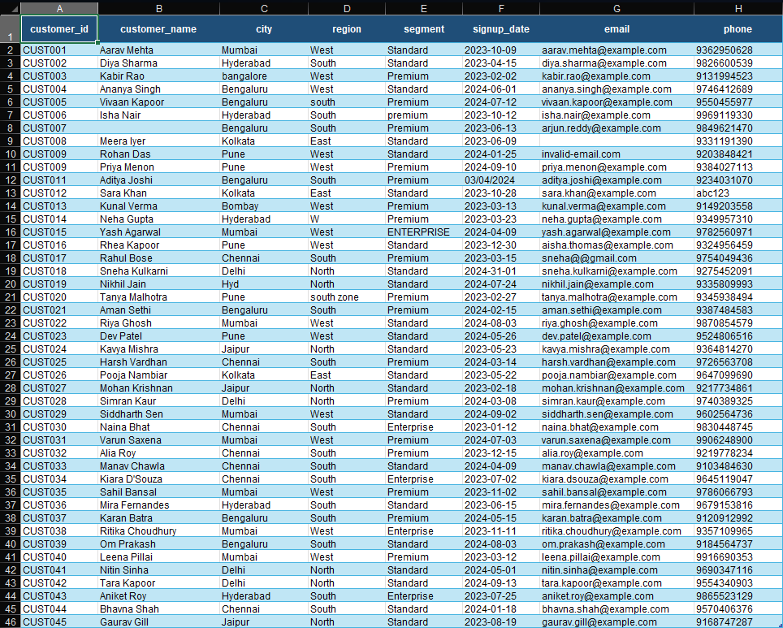
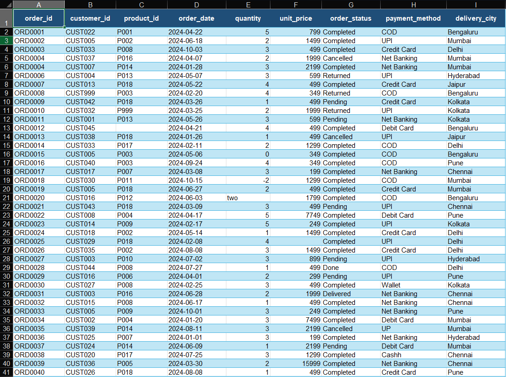
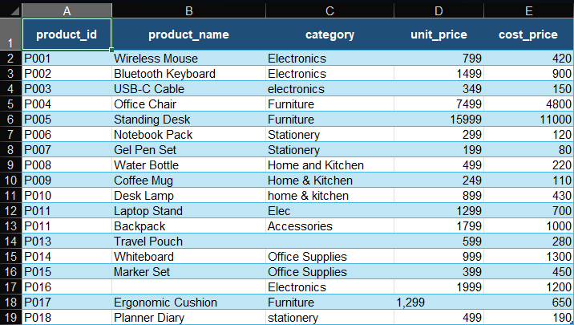

### 2. Cleaned Data 
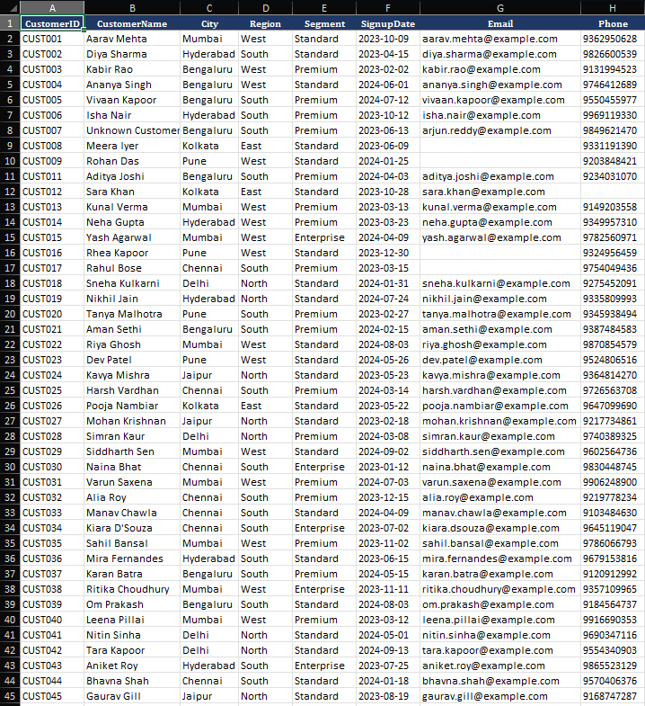
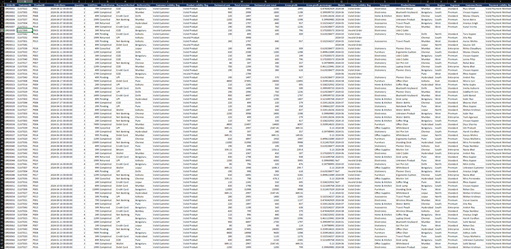
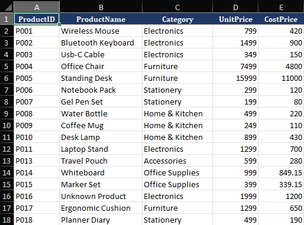

### 3. Cleaning Log 
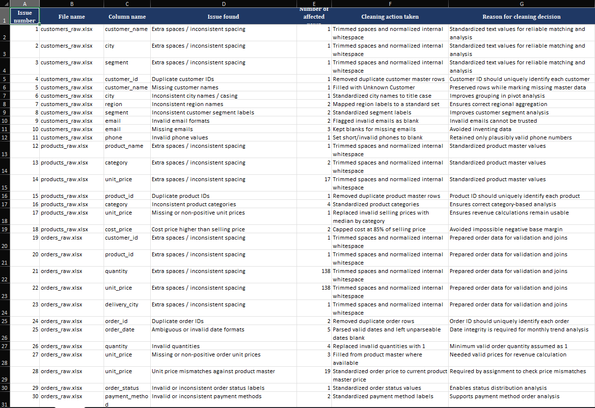

### 4. Final Dashboard 
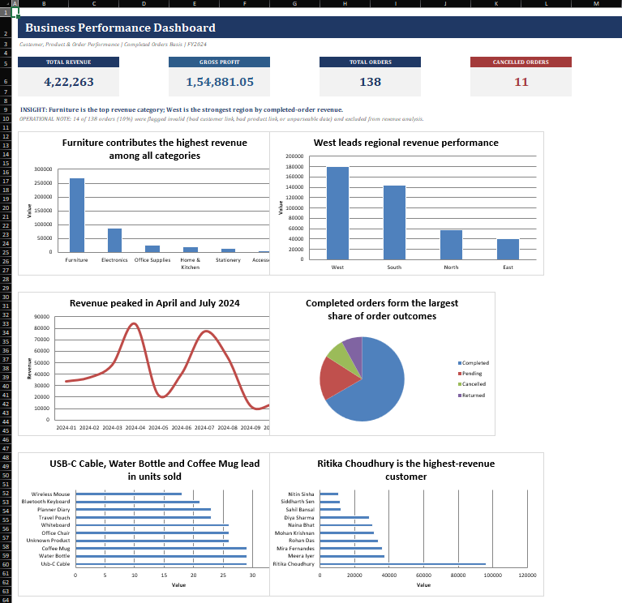

### 5. Pivot Table
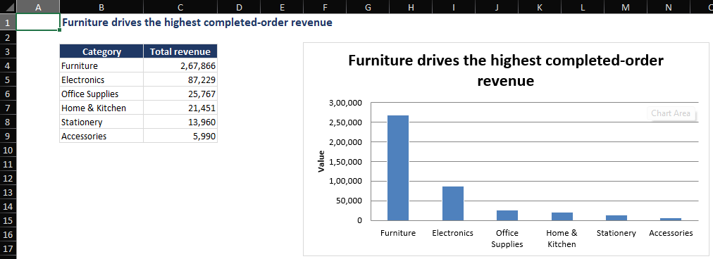
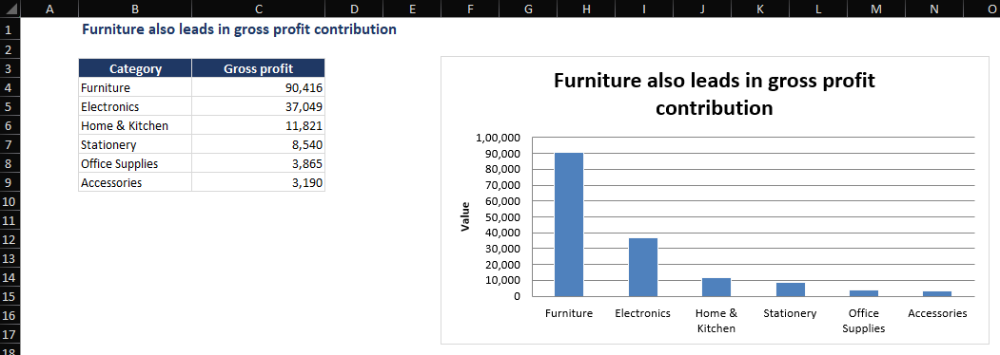
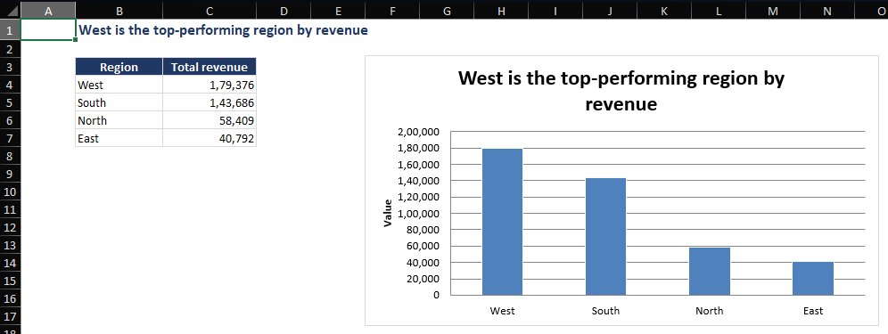
The screenshots include raw data, cleaned data, cleaning log, pivot analysis, and dashboard previews.

## Assumptions made
- Completed orders are treated as the primary basis for revenue and gross profit analysis.
- Missing or invalid cost prices were estimated where required to enable gross profit calculations.
- Invalid customer and product references were retained and flagged instead of being deleted to preserve data integrity and highlight operational issues.
- Order prices were standardized to the product master where pricing inconsistencies were identified.
- Invalid quantities were replaced with a default value of 1 only when necessary to maintain valid transactional records for analysis.
